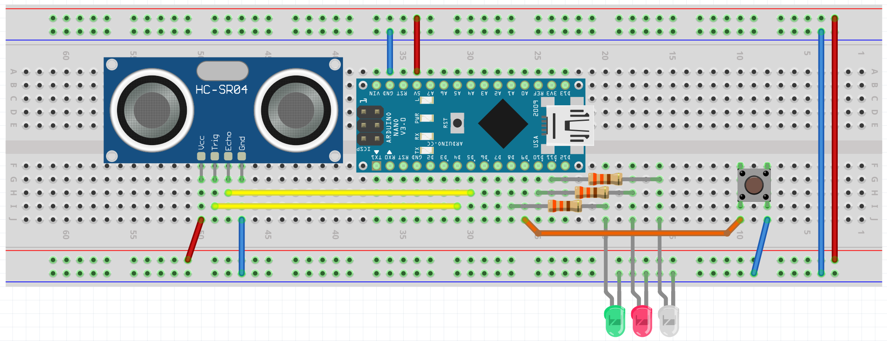
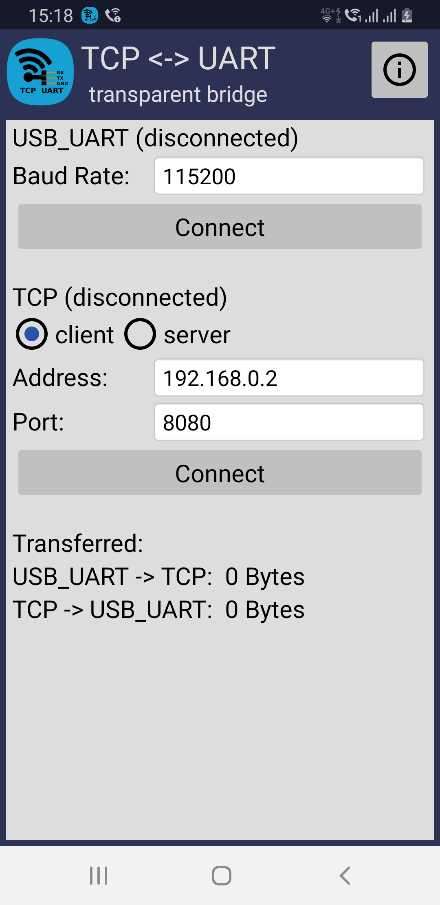
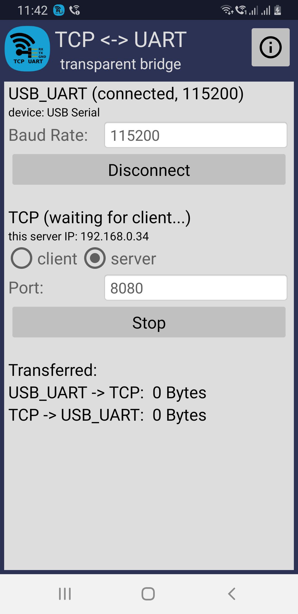
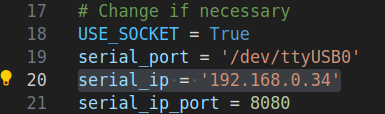
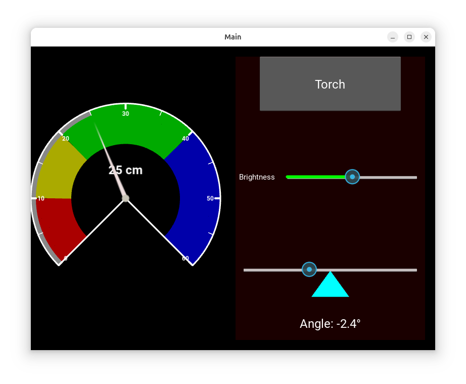
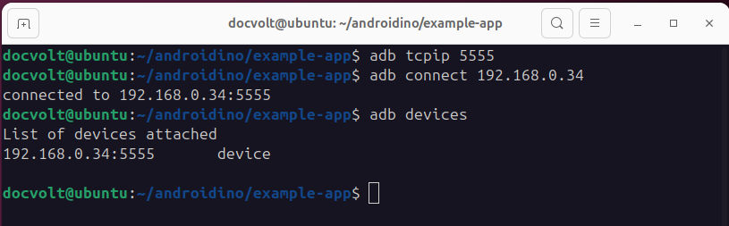
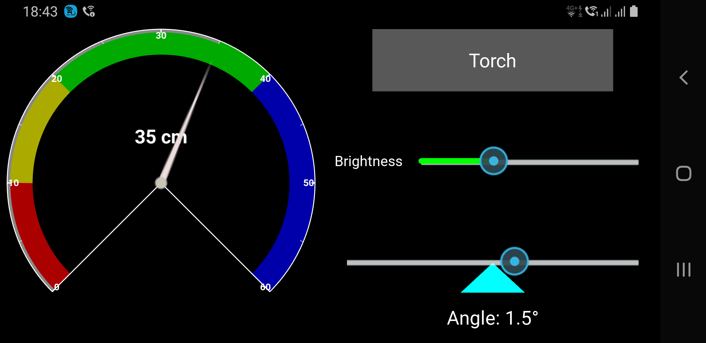
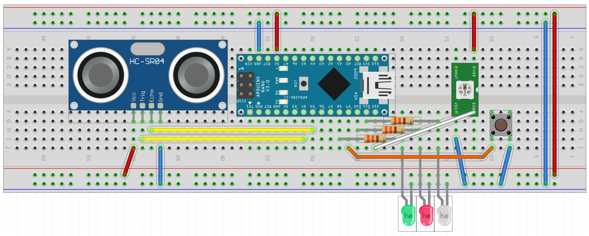

# Using an Android Phone as a Touch Display and Sensor box For Arduino

This is the example of an app for controlling an Arduino via USB, shown in this [video](https://youtu.be/aCQN9L7TSVg).
This step-by-step guide is specific to Linux systems and has been tested on Ubuntu 24.04 LTS and Windows Subsystem for Linux (Debian V12 "Bookworm").

## Circuit to Control



## Setting up the Serial Server on the Phone

The examYou can update the original file by copying the edited content and pasting it into the README.md file in your repository. Here are the steps:

1. Go to the [README.md file](https://github.com/michalin/androidino/edit/main/README.md) in your repository.
2. Click on the pencil icon to edit the file.
3. Replace the existing content with the updated content.
4. Scroll down to the "Commit changes" section.
5. Add a commit message summarizing the changes.
6. Choose "Commit directly to the main branch".
7. Click on "Commit changes".

This will update the README.md file with the corrected content.ple app cannot access the USB interface of the phone directly. Instead, it communicates over a TCP socket. This is provided by the TCPUART Transparent Bridge app. (Or similar)

- Install the [TCPUART transparent Bridge](https://play.google.com/store/apps/details?id=com.hardcodedjoy.tcpuart&pcampaignid=web_share) on your phone.  
- Connect the phone and the Arduino with the USB-OTG cable  
- Start the TCPUART transparent Bridge and tap on "Connect". Then grant USB permission.
- Check "server" and tap on "Start"

  

## Load the Telemetrix Example Sketch for Arduino

In Arduino IDE, install "Telemetrix4Arduino" via the library manager. Then load the example sketch (File > Examples > Telemetrix4Arduino > Telemetrix4Arduino) into the Arduino.

## Install Python and Dependencies on the PC

Use the following command to install Python 3 and related tools (if not already installed):

```bash
sudo apt install -y python-is-python3 python3-pip python3-venv
```

If you are on WSL (Deban) wihout GUI, install these additional packages:

```bash
sudo apt install -y libmtdev-dev ligl-dev
```

It's highly recommended to install the required Python packages in a virtual environment:

```bash
cd $HOME/androidino/example-app
python -m venv .venv
```

Activate the virtual environment:

```bash
source .venv/bin/activate
```

After that, the prompt should look something like  

```bash
(.venv) docvolt@ubuntu:~/androidino/example-app$ 
```

In this virtual environment, install the required Python packages:

```bash
pip install kivy telemetrix plyer
```

## Try the Example App

Open the example app [main_simple.py](example-app/main_simple.py) and enter the IP address of your phone. The IP is shown in the TCPUART app (192.168.0.34 in this example).



Start the app on the PC with ```python main_simple.py``` and click on "Connect"  



If everything has gone well, the instrument displays the distance of an object to the sonar and the RGB LED changes color accordingly. "Toggle" switches the LED on and off, "Brightness" changes the brightness. The green LED lights up when the "Angle" control is positioned above the triangle, otherwise the red LED lights up.

Now it's time to package this app for Android. This is done with the Buildozer tool.

## Packaging for Android with Buildozer

### Install Buildozer and the Necessary Packages  

```bash
sudo apt install -y git openjdk-17-jdk autoconf libffi-dev libtool libssl-dev 
```

Additionally, if you are on WSL:

```bash
sudo apt install -y unzip zip libncurses
```

Install Buildozer itself. Make sure you have activated the virtual environment.

```bash
pip install buildozer setuptools cython 
```

### Start packaging

Copy [main_simple.py](./example-app/main_simple.py) to main.py. For Buildozer to work, the file name must be "main.py". If you have changed the variable *ip_addr* to test the app on the PC before, set it back to "localhost".

```bash
cp main_simple.py main.py
```

Then start Buildozer

```bash
buildozer android debug
```

When running Buildozer for the first time, it will take a while to finish because it's setting up the entire environment needed to build the app. This includes downloading and configuring tools like the Android SDK, NDK, Python-for-Android, and other dependencies. On slow machines or Internet connections this can take up to two hours and more. Once the first run completes, future builds typically only take a few minutes.
When done, we are ready to deploy the app.

## Deploy and Run the App on the Phone

Before we can deploy and run the app on the phone, we must enable USB debugging.

**Note: WSL has no direct access to the USB port. To enable USB access see <https://learn.microsoft.com/en-us/windows/wsl/connect-usb>**

**Unlock Developer Options**  

1. Open the Settings App on your Android device.  
2. Scroll down and tap About Phone.
3. Locate the Build Number (might be under Software Information on some devices).  
4. Tap Build Number 7 times. You'll see a message: "You are now a developer!" (You may need to enter your PIN or password to confirm.)

**Enable USB Debugging**  

1. Go back to the Settings menu.
2. Scroll down and select Developer Options (usually located under System or Advanced).  
3. Scroll down to find the USB Debugging option.
4. Toggle USB Debugging to enable it. A confirmation popup will appear - tap OK.

**Enable Remote Debugging Over Wi-Fi**  

Wireless debugging is recommended so that you don't always have to switch the phone between the Arduino and the PC when you want to test a new app version.

Install ADB (Android Debug Bridge) on the Computer

```bash
sudo apt install -y adb
```

Verify the connection by running:

```bash
adb devices
```

You should see your Android devices listed.  

Run the following command to start the remote debugging service on port 5555

```bash
adb tcpip 5555
```

Allow access to the phone data, disconnect the USB cable from your phone and make sure that the phone is in the same network like the PC. Then type

```bash
adb connect <IP address>
```

You can always check the connection with  

```bash
adb devices
```



You should see your device listed with its IP address.
The remote debugging service remains active until the phone is restarted or you type ```adb usb```. When you are done, you should stop the service for security reasons.

```bash
adb disconnect <IP address>
adb usb
```

## Deploy and Run the App

Connect the phone and the Arduino with the USB-OTG cable and start the TCPUART app like described earlier.

Start the upload and run the app with.

```bash
buildozer android deploy run
```



## Running the Advanced Example

The advanced example controls an additional WS2812 RGB LED which changes its color according to the distance value.



## Configuring the Arduino

- Open the Arduino IDE, navigate to the Library Manager, and install the **Adafruit NeoPixel Library**.

- Open the sketch [example.ino](./example/example.ino) sketch in the Arduino IDE and upload it to your Arduino UNO or Nano board.

- Rename the file [main_advanced](./example-app/main_advanced.py) as main.py

- Start packaging, depoly and run on phone

```bash
buildozer android debug deploy run
```

## Debugging  

To rebuild the app and show debug messages in the terminal, just type

```bash
buildozer android debug deploy run logcat | grep python
```
